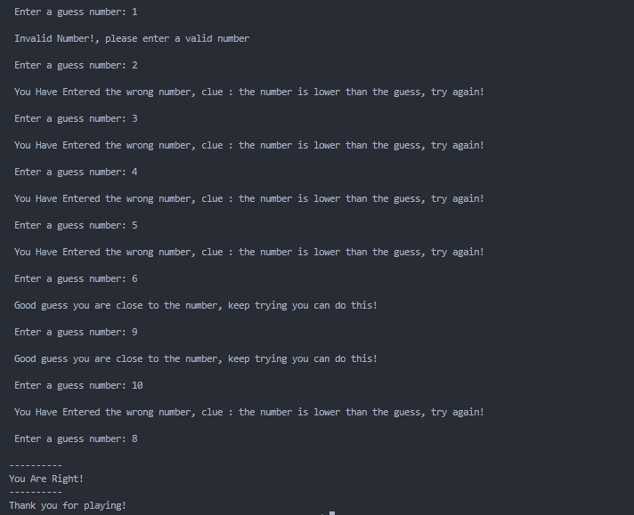

# Guess-Me-Right-Console-Game-C
Here in this project demo I have created a guess game in C that allows users to guess a specific number and find out if it was right or wrong the winner gets a congratulation log and the game exit

# Demo


# Installation
> sudo apt-get update
> sudo apt install ...

# Languages Used
1. C Programming

# Clone Project
```
  git clone git@github:oluyaratosin123...

```
```C
  cd guess_me
```

# Author
GitHub: [edward@github.com](https://github.com/oluyaratosin123)
Linkedin: [edward@linkedin.com](https://www.linkedin.com/in/edward-oluyara/)
Twitter: [edward@twitter.com](https://twitter.com/TOluyara)
AngelList: [edward@angelList.com]()
GitLab: [edward@gitLab.com]()

## Contributing :handshake:
Contributions, issues, and feature requests are welcome!

## Show your support
Give a 	:star: if you like this project.

## Acknowledgments
* Hat tip to anyone whose code was used
* Inspiration
* etc
